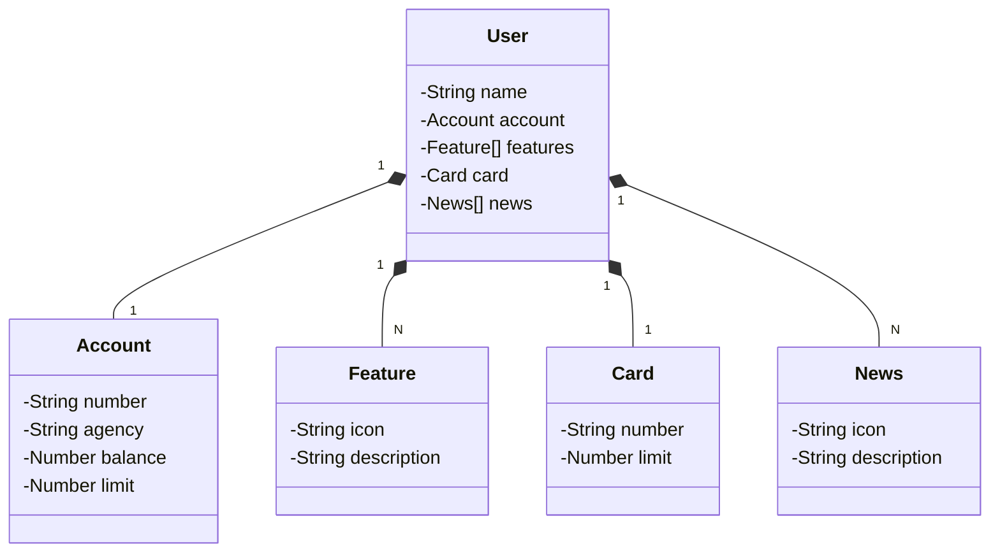

# 👨‍🎓 Java orientado a Objetos e API

👾Repositório destinado para armazenar meus estudos e projetos desenvolvidos no curso de Java orientado a objetos e API restful da DIO no bootcamp da Santander, onde aprimorei meus conhecimentos de Orientação a Objetos e fui introduzido aos mundos das APIS.

### 📚 Tecnologias

 

# Santander-dev-bootcamp-2024

## Diagrama de classes

